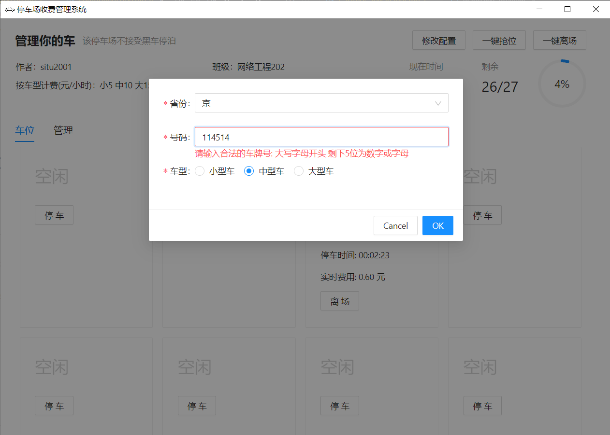

# 程序设计课程设计报告

## 课程设计题目及内容

### 题目

**停车场管理系统**

编写停车场管理程序，用于停车场对车辆的管理。程序能够实现可用车位统计与查询、零车位提示、停车时长统计、按车型时长收费、管理员收费累计等功能。

### 内容

**设计要求及提示如下：**

编写停车场收费管理系统，定义汽车类`Car`和管理员类`CarManager`。

`Car`类有`number`(车牌号),`model`(车型)、`enterTime`(入场时间)、 `quitTime`(出场时间)、`price`(每小时收费价)、cost(费用)等属性。

`CarManager`类有`id`和`key`等。

实现以下收费功能：

1. 可用车位统计与查询
2. 零车位提示
3. 停车时长统计
4. 按车型时长收费
5. 管理员收费累计

## 功能模块的设计分析及算法描述

### 思路

首先这是一个停车场的收费管理系统，注意 Keywords：**停车场**，**收费**，**管理**

然后先看看设计，我必须要定义`Car`和`CarManager`，根据列出来的属性，我可以推测，实体`Car`就是用来表达一辆车的状态和自身属性的，而`CarManager`的两个属性，我可以推测出，这应该是用来登录的。

接着再自己思考一下应该怎么做。

1. 先确定好这些类的职能
2. 想出系统的大致功能与逻辑
3. 用笔粗略画出界面的样子
4. 与用户交互是怎么样的
5. 着手开始实现

由于这个需要一个可视化的窗口程序，再加上最近学会了 JavaScript 想要做个项目练练手，正巧碰上了这次的课设，。

所以经过我的思考，再经过一番向老师的询问，最终决定这次的程序，主要使用这些技术栈：JavaScript + TypeScript + Electron + React + antd + Webpack + Babel + crypto-js + electron-store。而版本控制则使用 git

配合使用，即可做得一个（跨平台的）桌面应用程序。

### 设计与分析

从 Electron 官网可以得知，应用分为两个进程：main 与 renderer，前者为主进程，负责与系统 api 的通讯，后者主要为渲染进程，主要负责页面的渲染。

由于 main 进程主要负责与系统 api 的通讯。因此在该程序中，main 进程则负责配置文件的检查、配置文件读取与写入的 ipc 的建立、以及打开配置文件所在的文件夹的功能。

---

而对于 renderer 部分来说，就大致是窗口的主体部分了。程序的代码模块大致分为四部分

一是 models，为 Car 和 CarManager 类所存放的地方；

类的 UML 图如下


二是 controllers，为一些模块文件，里头存放着单例的 Car（分别为实时车位和停车记录）与 CarManager（支持多个管理员）的数组，用于读取与写入相对应实体的数据；

三是 views，用于存放 React 的 tsx 文件，为该应用窗口的主要代码。

还有四，utils，用于存放一些工具类型的模块。

一二三四结合之后，程序的模块就有大概如下的沟通了。

---

controllers 里头的模块，可以做到从配置文件读取记录，根据 models 里头的类的定义来实例化对象，并且把对象放入数组中。这些数组配有操作它们的方法以及写配置文件的方法。

例如，停车记录模块的初始化流程大致如下图


实时车位与登录模块的原理大体与上述一致。

---

然后是界面的渲染，由于该课程设计为面向对象程序设计，所以就没有采用 React 的 Hooks（函数式编程）而是用了 class component

大致流程是：在创建界面前，调用 controllers 的方法，得到当前数据以改变组件的`state`，然后调用`render()`渲染出界面。

该流程用函数表达式可以表达为

$$
f(state) = View
$$

界面的组件关系如该 UML 图所示（组合优于继承）


## 程序中使用的数据及主要符号说明

### 界面

| 类            | 介绍                                 |
| ------------- | ------------------------------------ |
| App           | 应用界面主入口                       |
| Head          | 应用界面的上部分（包含简介，信息等） |
| StatExtra     | 车位实时状况与实时时间               |
| Home          | 停车场                               |
| ParkingSpot   | 一个停车位                           |
| ManagerSwitch | 登录，以及组合了登录页与管理页       |
| Login         | 登录页                               |
| Manager       | 管理员                               |
| MyTable       | 停车记录表格                         |
| MyChart       | 停车记录饼状图                       |

---

### 实体类

| 类         | 作用               |
| ---------- | ------------------ |
| Car        | 表示一辆车         |
| CarManager | 表示停车场的管理员 |

---

### 运行时产生的文件数据

类图和主要功能逻辑都写在上面了，因此，这里只注明下运行时候产生的文件数据。

`config.json`：程序配置文件，里面记录着最大停车位，停车记录，停车场位置占用情况以及管理员的账号密码（密码已加密）。

关于 JSON 文件的键的说明

| Key                 | Description                       |
| ------------------- | --------------------------------- |
| carManager          | 车辆管理员们（密码已经 MD5 加密，如要添加管理员，属性key写明文密码即可，程序启动后会自动加密） |
| MAX_NUMBER_OF_SPOTS | 车位数                            |
| spots               | 实时车位的停车情况                |
| parkingLog          | 停车记录                          |

一个 config.json 示例如下

```json
{
  "carManager": [
    {
      "id": "114",
      "key": "59b90e1005a220e2ebc542eb9d950b1e"
    }
  ],
  "MAX_NUMBER_OF_SPOTS": 27,
  "spots": [
    null,
    {
      "number": "冀 A14514",
      "model": "LARGE",
      "enterTime": 1625216672232,
      "price": 15
    },
    null,
    null,
    null,
    null,
    null,
    null,
    null,
    null,
    null,
    null,
    null,
    null,
    null,
    null,
    null,
    null,
    null,
    null,
    null,
    null,
    null,
    null,
    null,
    null,
    null
  ],
  "parkingLog": [
    {
      "number": "京 COCO51",
      "model": "NORMAL",
      "enterTime": 1625216655008,
      "quitTime": 1625216679326,
      "price": 10,
      "cost": 0.06755
    }
  ]
}
```

## 部分关键程序的源代码

### 类 Car

```typescript
import { addToLog } from '../controllers/ParkLog';

const carModelToPrice = new Map<string, number>();
carModelToPrice.set('SMALL', 5);
carModelToPrice.set('NORMAL', 10);
carModelToPrice.set('LARGE', 15);

export const modelEngToChn = new Map<string, string>();
modelEngToChn.set('SMALL', '小型车');
modelEngToChn.set('NORMAL', '中型车');
modelEngToChn.set('LARGE', '大型车');

/**
 * class `Car`
 */
export default class Car {
  public number: string;

  public model: string;

  public enterTime: number;

  public quitTime: number | undefined;

  public price: number;

  public cost: number | undefined;

  /**
   * construct a `Car`
   * @param number car's number
   * @param model car's model
   */
  constructor(number: string, model: string) {
    this.number = number;
    this.model = model;
    this.enterTime = new Date().getTime();
    // default model is NORMAL
    this.price = carModelToPrice.get(this.model) ?? 10;
  }

  /**
   * when the car leaves
   */
  public leave(): void {
    this.quitTime = new Date().getTime();
    const totalTime = this.quitTime - this.enterTime;
    const hours = totalTime / 1000 / 3600;
    this.cost = hours * this.price;
    // add to parking log
    addToLog(this);
  }
}
```

### 类 CarManager

```typescript
import MD5 from 'crypto-js/md5';

/**
 * CarManager, used when you log in the manager page.
 */
export default class CarManager {
  private id: string;

  private key: string;

  /**
   * construct a CarManager
   * @param id manager's id(plain)
   * @param keyMD5 manager's key(MD5)
   */
  constructor(id: string, keyMD5: string) {
    this.id = id;
    this.key = keyMD5;
  }

  /**
   * check the input id(plain) and key(plain) to determine that you can enter the manager page
   * @param id your input id(plain)
   * @param keyPlain your input key(plain)
   * @returns login success or not
   */
  public login(id: string, keyPlain: string): boolean {
    return id === this.id && MD5(keyPlain).toString() === this.key;
  }
}
```

### 登录验证

```typescript
/**
 * helper function for login
 * @param id your input id(plain)
 * @param keyPlain your input key(plain)
 * @returns login success or not
 */
export default function login(id: string, key: string) {
  return carManagers.some((manager) => manager.login(id, key));
}
```

### 启动时

```typescript
import Store from 'electron-store';

// init store
Store.initRenderer();

// check config
checkConfigFile();

// register ipc
ipcMain.on('showConfigDir', () => {
  shell.openPath(app.getPath('userData'));
  dialog
    .showMessageBox({
      buttons: ['确定', '取消'],
      message: '修改config.json后按确定以加载配置',
      type: 'warning',
      defaultId: 1,
      cancelId: 1,
    })
    .then((v) => {
      // eslint-disable-next-line promise/always-return
      if (v.response === 0) {
        app.relaunch();
        app.quit();
      }
    })
    .catch(() => {});
});
```

### 配置文件检查

```typescript
import Store from 'electron-store';
import MD5 from 'crypto-js/md5';

/**
 * check config file
 */
export default function checkConfigFile(): void {
  const store = new Store();
  // check some config keys
  if (!store.has('carManager')) {
    // if carManager does not existed in store, set default manager
    store.set('carManager', [
      {
        id: '114',
        key: MD5('514').toString(),
      },
    ]);
  } else {
    const managers = store.get('carManager') as { id: string; key: string }[];

    if (managers.length === 0) {
      // if carManager is empty, set default manager
      store.set('carManager', [
        {
          id: '114',
          key: MD5('514').toString(),
        },
      ]);
    } else {
      managers.forEach((manager) => {
        if (!manager.key.match(/^[a-fA-F0-9]{32}$/g)) {
          // if key does not match the expr, convert it to MD5
          manager.key = MD5(manager.key).toString();
        }
      });
      store.set('carManager', managers);
    }
  }
  if (!store.has('MAX_NUMBER_OF_SPOTS')) {
    store.set('MAX_NUMBER_OF_SPOTS', 27);
  }
}
```

### 停车页面

```tsx
/* eslint-disable react/prefer-stateless-function */

// Route: /, for showing the car
import React from 'react';
import {
  Row,
  Col,
  FormInstance,
  Modal,
  Form,
  Input,
  Select,
  Radio,
} from 'antd';
import ParkingSpot from './ParkingSpot';
import { currentSpots, leave, park } from '../controllers/Spots';
import Car, { modelEngToChn } from '../models/Car';
import { province } from '../models/Data';

const { Option } = Select;

type State = {
  modalShow: boolean;
  spotWillBePark: number;
};

export default class Home extends React.Component<any, State> {
  private formRef;

  // eslint-disable-next-line @typescript-eslint/no-useless-constructor
  constructor(props: any) {
    super(props);
    this.formRef = React.createRef<FormInstance>();
    this.state = {
      modalShow: false,
      spotWillBePark: 0,
    };
  }

  private leaveCarCallback = (index: number) => {
    leave(index);
    // update this component
    this.setState({});
  };

  private parkCarCallback = (spotIndex: number) => {
    // update this component & set spotWillBePark
    this.setState({ modalShow: true, spotWillBePark: spotIndex });
  };

  // read info from Form when modal OK
  private onModalOK = () => {
    this.formRef.current
      ?.validateFields()
      .then(() => {
        // get info from Form
        // eslint-disable-next-line @typescript-eslint/no-shadow
        const province = this.formRef.current?.getFieldValue('province');
        const no: string = this.formRef.current?.getFieldValue('no') as string;
        const model = this.formRef.current?.getFieldValue('model');
        const finalNo = `${province} ${no.toUpperCase()}`;
        // get index
        const { spotWillBePark } = this.state;
        // new a Car
        park(new Car(finalNo, model), spotWillBePark);
        // reset
        // eslint-disable-next-line promise/always-return
        this.formRef.current?.resetFields();
        this.setState({ modalShow: false });
      })
      .catch(() => {});
  };

  // handle modal cancel
  private onModelCancel = () => this.setState({ modalShow: false });

  render() {
    const currentSpotsData = currentSpots();
    const { modalShow } = this.state;

    return (
      <>
        <Row
          gutter={[16, 16]}
          style={{
            padding: '8px 0 0 0',
            marginLeft: '0px',
            marginRight: '0px',
          }}
        >
          {currentSpotsData.map((car, index) => (
            // Because the array is length-fixed & position-fixed...
            // eslint-disable-next-line react/no-array-index-key
            <Col span={6} key={index}>
              <ParkingSpot
                car={car ?? null}
                leaveCarCallback={this.leaveCarCallback}
                parkCarCallback={this.parkCarCallback}
                number={index}
              />
            </Col>
          ))}
        </Row>
        <Modal
          visible={modalShow}
          closable={false}
          onCancel={this.onModelCancel}
          onOk={this.onModalOK}
        >
          <Form
            ref={this.formRef}
            initialValues={{
              province: province[0],
              no: 'COCO51',
              model: 'NORMAL',
            }}
          >
            <Form.Item
              name="province"
              label="省份"
              rules={[{ required: true, message: '请选择你的省份' }]}
            >
              <Select placeholder="请选择你的省份">
                {province.map((v, i) => (
                  // eslint-disable-next-line react/no-array-index-key
                  <Option value={v} key={i}>
                    {v}
                  </Option>
                ))}
              </Select>
            </Form.Item>
            <Form.Item
              name="no"
              label="号码"
              rules={[
                {
                  required: true,
                  pattern: new RegExp(
                    /^[A-Za-z]{1}[A-Za-z0-9]{4}[A-Za-z0-9挂学警港澳]{1}$/,
                    'g'
                  ),
                  message:
                    '请输入合法的车牌号: 大写字母开头 剩下5位为数字或字母',
                },
              ]}
            >
              <Input />
            </Form.Item>
            <Form.Item
              name="model"
              label="车型"
              rules={[{ required: true, message: '请选择你的车型' }]}
            >
              <Radio.Group>
                {['SMALL', 'NORMAL', 'LARGE'].map((v, i) => (
                  // eslint-disable-next-line react/no-array-index-key
                  <Radio value={v} key={i}>
                    {modelEngToChn.get(v)}
                  </Radio>
                ))}
              </Radio.Group>
            </Form.Item>
          </Form>
        </Modal>
      </>
    );
  }
}
```

### 登录页

```tsx
// login page for Manager
/* eslint-disable react/prefer-stateless-function */
import { FormInstance, Form, Input, Button, message } from 'antd';
import React from 'react';
import login from '../controllers/Login';
import './styles/Login.global.css';

type Props = {
  refresh: () => void;
  foo: number;
};

export default class Login extends React.Component<Props> {
  private formRef;

  constructor(props: Props) {
    super(props);
    this.formRef = React.createRef<FormInstance>();
  }

  private onFinished = (v: { username: string; password: string }) => {
    if (login(v.username, v.password)) {
      localStorage.setItem('loggedIn', 'true');
      message.success('登录成功');
    } else {
      message.error('账号或密码输入错误');
    }

    const { refresh } = this.props;
    refresh();
  };

  render() {
    return (
      <div className="container">
        <p className="login-hint">登录</p>
        <Form
          ref={this.formRef}
          onFinish={this.onFinished}
          className="login-form"
        >
          <Form.Item
            name="username"
            rules={[{ required: true, message: '请输入你的用户名!' }]}
          >
            <Input placeholder="请输入用户名" />
          </Form.Item>
          <Form.Item
            name="password"
            rules={[{ required: true, message: '请输入你的密码!' }]}
          >
            <Input.Password placeholder="请输入密码" />
          </Form.Item>
          <Button type="primary" htmlType="submit">
            Login
          </Button>
        </Form>
        <div className="hint">
          <p>初始用户114 密码514</p>
          <p>请前往配置文件修改</p>
        </div>
      </div>
    );
  }
}
```

### 管理员页

```tsx
/* eslint-disable react/prefer-stateless-function */
import { Button, message, Statistic, Switch } from 'antd';
import React from 'react';
import {
  clearLog,
  getCostByModel,
  getLog,
  getTotalCost,
} from '../controllers/ParkLog';
import Car from '../models/Car';
import Chart from './Chart';
import './styles/Manager.global.css';
import MyTable from './Table';

type Props = {
  refresh: () => void;
  foo: number;
};

type State = {
  isSwitchOn: boolean;
  costDataByModel: { value: number; type: string }[];
  parkLog: Car[];
};

export default class Manager extends React.Component<Props, State> {
  constructor(props: Props) {
    super(props);
    this.state = {
      isSwitchOn: false,
      costDataByModel: getCostByModel(),
      parkLog: getLog(true),
    };
  }

  componentDidUpdate(prev: Props) {
    const { foo } = this.props;
    if (prev.foo !== foo) {
      // eslint-disable-next-line react/no-did-update-set-state
      this.setState({
        costDataByModel: getCostByModel(),
        parkLog: getLog(true),
      });
    }
  }

  render() {
    const { refresh } = this.props;

    const { isSwitchOn, costDataByModel, parkLog } = this.state;

    return (
      <div style={{ padding: '8px' }}>
        <div
          style={{
            display: 'flex',
            justifyContent: 'flex-end',
          }}
        >
          <Switch
            style={{ marginRight: '16px' }}
            unCheckedChildren="表格"
            checkedChildren="图表"
            onChange={(checked) => this.setState({ isSwitchOn: checked })}
          />
          <Button
            style={{ marginRight: '16px' }}
            onClick={() => {
              message.success('退出登录成功');
              localStorage.setItem('loggedIn', 'false');
              refresh();
            }}
          >
            退出登录
          </Button>
          <Button
            style={{ marginRight: '16px' }}
            onClick={() => {
              message.success('清除记录成功');
              clearLog();
              this.setState({ parkLog: getLog(true) });
              refresh();
            }}
          >
            清除日志
          </Button>
          <Statistic
            className="income"
            title="收入"
            value={`${getTotalCost()}元`}
          />
        </div>
        {!isSwitchOn ? (
          <MyTable data={parkLog} />
        ) : (
          <Chart data={costDataByModel} />
        )}
      </div>
    );
  }
}
```

#### 管理员页--表格

```tsx
/* eslint-disable react/prefer-stateless-function */
import React from 'react';
import { Table } from 'antd';
import Car, { modelEngToChn } from '../models/Car';
import formatTime from '../utils/formatTime';

const dateFormatter = (d: number) => {
  const date = new Date(d);
  return `${date.getFullYear()}-${date.getMonth()}-${date.getDate()} ${formatTime(
    date
  )}`;
};

// table columns
const columns = [
  {
    title: '车牌号',
    dataIndex: 'number',
  },
  {
    title: '车型',
    render: (model: string) => modelEngToChn.get(model),
    dataIndex: 'model',
  },
  {
    title: '入场时间',
    dataIndex: 'enterTime',
    render: dateFormatter,
    sorter: {
      compare: (a: Car, b: Car) => {
        return a.enterTime - b.enterTime;
      },
      multiple: 1,
    },
  },
  {
    title: '离场时间',
    dataIndex: 'quitTime',
    render: dateFormatter,
    sorter: {
      compare: (a: Car, b: Car) => {
        return (a.quitTime ?? 1) - (b.quitTime ?? 0);
      },
      multiple: 2,
    },
  },
  {
    title: '消费金额',
    dataIndex: 'cost',
    render: (cost: number) => cost.toFixed(2),
    sorter: {
      compare: (a: Car, b: Car) => {
        return (a.cost ?? 1) - (b.cost ?? 0);
      },
      multiple: 3,
    },
  },
];

export default class MyTable extends React.Component<{ data: Car[] }> {
  render() {
    const { data } = this.props;

    return (
      <Table
        columns={columns}
        dataSource={data}
        pagination={{ position: ['topLeft'] }}
        rowKey="id"
      />
    );
  }
}
```

#### 管理员页--饼状图

```tsx
/* eslint-disable react/jsx-props-no-spreading */
/* eslint-disable react/prefer-stateless-function */
import React from 'react';
import { Pie } from '@ant-design/charts';
import { PieConfig } from '@ant-design/charts/es/pie';
import { Datum } from '@antv/g2/lib/interface';
import { modelEngToChn } from '../models/Car';

export default class MyChart extends React.Component<{
  data: { value: number; type: string }[];
}> {
  render() {
    const { data } = this.props;

    const config: PieConfig = {
      appendPadding: 10,
      data,
      angleField: 'value',
      colorField: 'type',
      radius: 0.8,
      label: {
        type: 'outer',
        content: '{name} {percentage}',
      },
      interactions: [{ type: 'pie-legend-active' }, { type: 'element-active' }],
      tooltip: {
        fields: ['value', 'type'],
        formatter: (datum: Datum) => {
          return {
            name: modelEngToChn.get(datum.type) as string,
            value: `${datum.value}元`,
          };
        },
      },
    };

    return (
      <div>
        <Pie {...config} />
      </div>
    );
  }
}
```

## 程序运行时的效果图

### 首次打开


### 停一辆车


### 验证车牌输入（正则匹配）



### 离场


### 一键停车（之后停车位满了）


### 一键离场


### 登录


### 管理页--表格


### 管理页--饼状图


### 清空记录


### 可修改配置文件（车位和管理员）


### 修改车位后


## 实验结果分析，实验收获和体会

> “Any application that can be written in JavaScript, will eventually be written in JavaScript.”
>
> ---**Atwood's Law**

### 分析

这次实验让我明白了一个小型系统是如何构建的，这个系统的数据是怎么管理与维护的。

与此同时，还学会了一些使用和部分原理。

1. JS 的打包工具的`WebPack`的大致操作与原理
2. 懂得了 TypeScript 是如何给予 JavaScript 强类型的
3. 学习了 npm 包`electron-store`的源码
4. 懂得了不同运行环境下的 JavaScript 的不同功能（比如 Nodejs 环境下的 JS 可以读写文件，操作一些 OS 的 API，而浏览器环境下不能）
5. 让我又一次实战了 Git 的使用（虽然 commit 的内容不是很漂亮规矩，还得学会更好更规范地使用）
6. `PlantUML`是如何帮我绘制 UML 图和流程图从而大大提高画图效率的。
7. `localStorage`的简易使用

### 收获与体会

第一次用 electron 和 react 做了个自认为还算可以的桌面程序，从中学到不少。同时也反映出自己技术的一些不足之处。

首先是布局，我的 CSS 中的 flex 布局还没怎么学习，导致布局起来有点不顺手。不过在该应用中，微小的布局操作就可以了。以后要刻意学习一下布局。

然后是 React，由于有部分现学现用，并且下手之前没有想好个大概，靠直觉来画页面和做逻辑，导致有部分地方的 status 有点混乱，得好好改正一下这个习惯——写代码前最好画画图撸个大概思路。

于是在本课设周的周四数电考试前重构了一部分。并且加深了对生命周期的了解。


## 自评成绩

自评为优。

虽然能够稳稳地跑起来了，但是......

因为时间紧迫，代码里头的类型出现了一坨`any`，这是一种对自己对他人不负责的行为。并且有一些地方写出了硬编码（比如车型）。需要日后修改。

经过老师的提示，我似乎没有考虑到车位的大小，看来是考虑不周啊。以后要全面考虑问题。

并且自己检查的时候，发现之前的 react 的一些使用姿势不是很对，因此重构了一下。后来又了解到 Redux，考虑以后写规模不是很小的 React 应用的时候加上。
